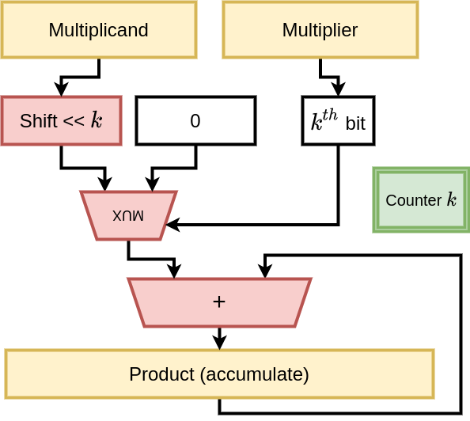

# Assignment - Multiplication

This assignment deals with implementation of a sequential and combinational multiplier in Verilog HDL.  

# Acknowledgement

Several parts of the code are taken from course Computer Organisation EE2003, IIT Madras by Prof. Nitin Chandrachoodan.

## Goals

- Demonstrate basic working knowledge of verilog
- Practise synthesis using Xilinx 
- Analyse on maximum operating frequency 

## Given

- Test bench for sequential, combinational multiplier 
- Template code that you can use to fill in
- Some test cases

## Details on the assignment

### Multiplication

This basically refers to the "long form" multiplication as we learn in school.  For each digit of the multiplier, we shift the multiplicand to the appropriate place value, and then add all the partial products.  An example of the partial products in binary for a simple 4-bit multiplication are shown below.  As expected, multiplying two 4-bit numbers can result in an output that is up to 8 bits in length.  

```
        0110    # Decimal 6 - Multiplicand
      x 0011    # Decimal 3 - Multiplier
    --------
        0110    # Partial product 0 (PP0)
       0110     # PP1
      0000      # PP2 
     0000       # PP3
    --------
    00010010    # Decimal 18
    --------
```

### Number representation

The numbers themselves are represented in 2's complement notation.  Therefore, if the multiplicand is negative, the PP values should be "sign-extended" to get the correct result.  An example for negative multiplicand is shown below - negative multiplier requires similar careful handling, and is left as an exercise.

```
        1010    # Decimal -6
      x 0011    # Decimal 3
    --------
    11111010    # Partial product 0 (PP0) - sign extended
    1111010     # PP1
    000000      # PP2 
    00000       # PP3
    --------
 (1)11101110    # Decimal -18 (discard the overflow 1)
    --------
```

### Hardware implementation

The above multiplication process can be directly implemented as combinational logic, where each partial product vector is created using a set of AND gates, and the results are put through a chain of adders.

The other alternative is to have a reduced hardware with a single register to hold the final product.  This **accumulates** the final product by iterating over several clock cycles (how many?).  A diagram indicating the architecture is shown here.




## HowTo

You are given a test bench with suitable test cases (`test_in.dat`).  The assignment repository also contains a bash script that will compile the code and run the tests. Proceed to Xilinx Synthesis after simulation works. Running the bash file requires icarus verilog. 
